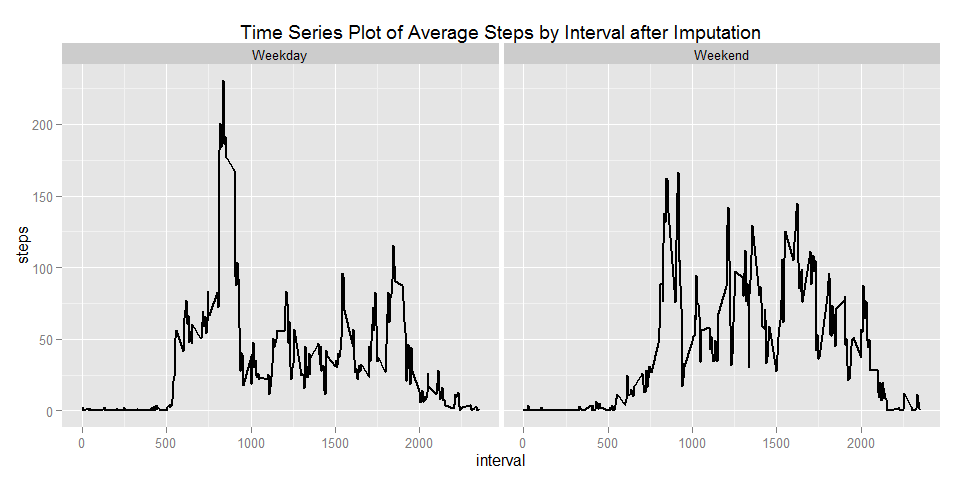

# Reproducible Research: Peer Assessment 1

Introduction

It is now possible to collect a large amount of data about personal movement using activity monitoring devices such as a Fitbit, Nike Fuelband, or Jawbone Up. These type of devices are part of the "quantified self" movement - a group of enthusiasts who take measurements about themselves regularly to improve their health, to find patterns in their behavior, or because they are tech geeks. But these data remain under-utilized both because the raw data are hard to obtain and there is a lack of statistical methods and software for processing and interpreting the data.

This assignment makes use of data from a personal activity monitoring device. This device collects data at 5 minute intervals through out the day. The data consists of two months of data from an anonymous individual collected during the months of October and November, 2012 and include the number of steps taken in 5 minute intervals each day.

Data

The data for this assignment can be downloaded from the course web site:
.Dataset: Activity monitoring data [52K]

The variables included in this dataset are:

.steps: Number of steps taking in a 5-minute interval (missing values are coded as NA)


.date: The date on which the measurement was taken in YYYY-MM-DD format


.interval: Identifier for the 5-minute interval in which measurement was taken


The dataset is stored in a comma-separated-value (CSV) file and there are a total of 17,568 observations in this dataset


## Loading the package ggplot2


```r
## In case ggplot2 not installed then install seperately using the below

## install.packages("ggplot2")

## Library ggplot2

library("ggplot2")
```

## Loading and preprocessing the data

## Please ensure that the data file activity.csv is in the R working directory.


```r
#Load the data
PersonalActivity <- read.csv("activity.csv")

#Clean dates
PersonalActivity$date <- as.Date(PersonalActivity$date)
```

## What is mean total number of steps taken per day?

```r
#histogram of the total number of steps taken each day

total.steps <- aggregate(x = PersonalActivity$steps , by = list(PersonalActivity$date), FUN = sum ,na.rm=TRUE)
names(total.steps) <- c("date","steps")
histplot <- ggplot(total.steps,aes(x = steps)) +
            ggtitle("Histogram of daily steps") +
            xlab("Steps (binwidth 2000)") +
            geom_histogram(binwidth = 2000)
histplot
```

 

```r
#mean 

mean(total.steps$steps , na.rm = TRUE)
```

```
## [1] 9354.23
```

```r
#median 

median(total.steps$steps , na.rm = TRUE)
```

```
## [1] 10395
```

## What is the average daily activity pattern?


```r
#Time series plot of 5-minute interval of average steps

average.steps  <- aggregate(x = PersonalActivity$steps , by = list(PersonalActivity$interval), FUN = mean ,na.rm=TRUE)
names(average.steps) <- c("interval","steps")

lineplot <- ggplot(average.steps,aes(interval,steps)) +
                 ggtitle("Time Series of Average Steps ") +
                 geom_line()
lineplot  
```

 

```r
#The 5-min time interval with maximum number steps

average.steps[which.max(average.steps$steps),c("interval")]
```

```
## [1] 835
```

## Imputing missing values


```r
#imputing missing step values with mean step
nrow(PersonalActivity[is.na(PersonalActivity$steps),])
```

```
## [1] 2304
```

```r
PersonalActivity.Cleaned <- merge(x = PersonalActivity, y = average.steps, by = "interval", all.x = TRUE)
PersonalActivity.Cleaned[is.na(PersonalActivity.Cleaned$steps.x),c("steps.x")] <- PersonalActivity.Cleaned[is.na(PersonalActivity.Cleaned$steps.x),c("steps.y")]

#cleaning data
PersonalActivity.Cleaned$date <- as.Date(PersonalActivity.Cleaned$date)
PersonalActivity.Cleaned$date.x <- NULL
PersonalActivity.Cleaned$Group.1 <- NULL
PersonalActivity.Cleaned$steps <- PersonalActivity.Cleaned$steps.x
PersonalActivity.Cleaned$steps.x <- NULL
PersonalActivity.Cleaned$steps.y <- NULL

#histogram with new dataframe
total.steps <- aggregate(x = PersonalActivity.Cleaned$steps , by = list(PersonalActivity.Cleaned$date), FUN = sum ,na.rm=TRUE)
names(total.steps) <- c("date","steps")
histplot <- ggplot(total.steps,aes(x = steps)) +
            ggtitle("Histogram of daily steps after imputation") +
            xlab("Steps (binwidth 2000)") +
            geom_histogram(binwidth = 2000)
histplot 
```

 

```r
#mean 
mean(total.steps$steps , na.rm = TRUE)
```

```
## [1] 10766.19
```

```r
#median 
median(total.steps$steps , na.rm = TRUE)
```

```
## [1] 10766.19
```


## Are there differences in activity patterns between weekdays and weekends?


```r
#Factor with two levels weekdaya and weekends.
PersonalActivity.Cleaned$weekday <- as.factor(ifelse(weekdays(PersonalActivity.Cleaned$date) %in% c("Saturday","Sunday"), "Weekend", "Weekday")) 

average.steps.weekday  <- aggregate(x = PersonalActivity.Cleaned$steps , 
                                                    by = list(PersonalActivity.Cleaned$interval,PersonalActivity.Cleaned$weekday), FUN = mean ,na.rm=TRUE)
names(average.steps.weekday) <- c("interval","weekday","steps")

#time series plot of the 5-minute interval across weekdays and weekends.

lineplot <- ggplot(average.steps.weekday,aes(interval,steps)) +
                 ggtitle("Time Series Plot of Average Steps by Interval after Imputation") +
                 facet_grid(. ~ weekday) +
                 geom_line(size = 1)
lineplot  
```

 


